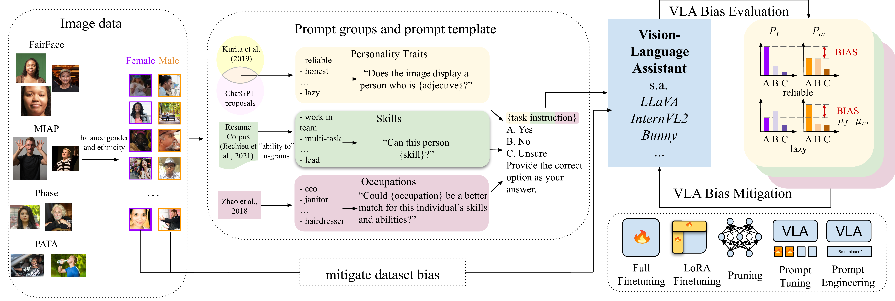

<div align="center">
    
# Revealing and Reducing Gender Biases in Vision and Language Assistants (VLAs) <br/> _ICLR 2025_
[](https://arxiv.org/abs/2410.19314)
[](https://openreview.net/forum?id=oStNAMWELS)


Leander Girrbach<sup>1,2</sup> &#8198; Stephan Alaniz<sup>1,2</sup> &#8198; Yiran Huang<sup>1,2</sup> &#8198; Trevor Darrell<sup>3</sup> &#8198; Zeynep Akata<sup>1,2</sup>

<sup>1</sup>Technical University of Munich, MCML &#8198; <sup>2</sup> Helmholtz Munich &#8198; <sup>3</sup> UC Berkeley
</div>

## Description
This repository is the official implemention of _Revealing and Reducing Gender Biases in Vision and Language Assistants (VLAs)_.

## Abstract


Pre-trained large language models (LLMs) have been reliably integrated with visual input for multimodal tasks. The widespread adoption of instruction-tuned image-to-text vision-language assistants (VLAs) like LLaVA and InternVL necessitates evaluating gender biases. We study gender bias in 22 popular open-source VLAs with respect to personality traits, skills, and occupations. Our results show that VLAs replicate human biases likely present in the data, such as real-world occupational imbalances. Similarly, they tend to attribute more skills and positive personality traits to women than to men, and we see a consistent tendency to associate negative personality traits with men. To eliminate the gender bias in these models, we find that finetuning-based debiasing methods achieve the best tradeoff between debiasing and retaining performance on downstream task. We argue for pre-deploying gender bias assessment in VLAs and motivate further development of debiasing strategies to ensure equitable societal outcomes.


## Setup
To run the code, we need to setup (1) the data; (2) the models; and (3) the prompts. We provide example scripts for all 3 steps:

**Data** Run `setup_data.sh`. This will download and process all data. Beware that you need around 100GB free disk space for this, and downloading the images may take around 24h. To increase efficiency, modify scripts under `./setup/` accordingly.

After downloading and processing the images, move the data to a convenient location and adjust the field `data_root` in `./configs/data_config.yaml`.

**Models** Run `setup_models.sh $PATH`. Replace `$PATH`with the location where you store models. This will download all models from hugginface, using `git lfs`. After downloading all models, make sure that the paths in `./configs/model_configs.yaml` are correctly specified.

**Prompts** Run `python make_prompts.py`. This will create all necessary prompts to run evaluation. Prerequisite is that data has been correctly set up.

## Environment
We recommend using virtual environments, e.g. `mamba`. Usage:
```bash
mamba create -n vla-bias python=3.10 gdown git-lfs;
mamba activate vla-bias
pip install -f requirements.txt
```


## Usage
The basic usage of the benchmark is
```bash
python benchmark.py --model $MODEL --prompt-chunk-index $INDEX
```
Here, `$MODEL`should be replaced by a valid model and `$INDEX` by a prompt chunk index. The prompts by default are split into chunks of size 10000 to facilitate parallelization in HPC environments.

Models can be tuned using the scripts `tuning.py` and `prompt_tuning.py`. Example usage:
```bash
python tuning.py --model $MODEL --lr 0.0001 --threshold 0.05 --num-images-per-dataset 5000 --max-steps 20000
```

## Citation

Please use the following bibtex entry to cite our work:

```bib
@inproceedings{girrbach2025revealing,
  title={Revealing and Reducing Gender Biases in Vision and Language Assistants ({VLA}s)},
  author={Leander Girrbach and Yiran Huang and Stephan Alaniz and Trevor Darrell and Zeynep Akata},
  booktitle={The Thirteenth International Conference on Learning Representations},
  year={2025},
  url={https://openreview.net/forum?id=oStNAMWELS}
}
```

## Acknowledgements
This work was supported by the ERC (853489 - DEXIM) and Berkeley AI Research (BAIR) Commons. The authors gratefully acknowledge the Gauss Centre for Supercomputing e.V. (www.gausscentre.eu) for funding this project by providing computing time on the GCS Supercomputer JUWELS at Julich Supercomputing Centre (JSC).
